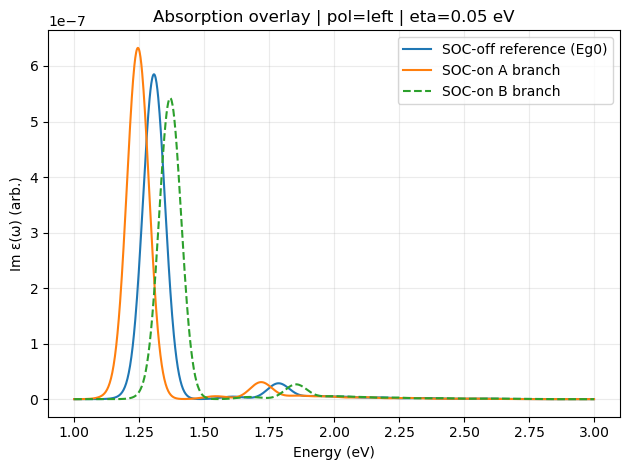
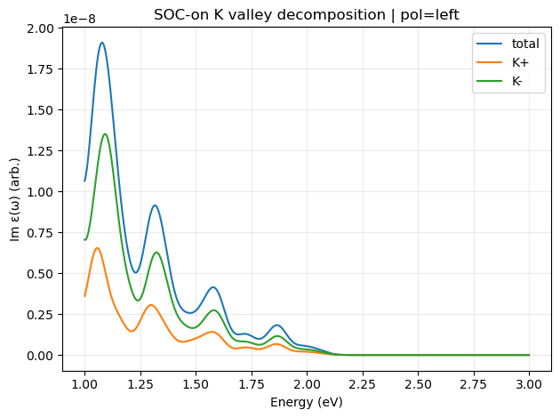
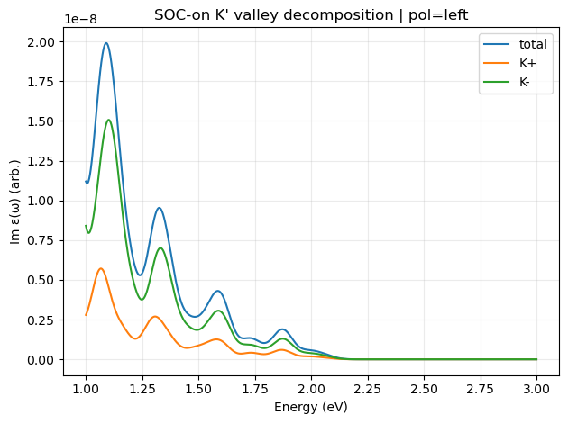

# K/K' Valley Dirac + BSE Optical Model from Quantum ESPRESSO XML

## Recommended starting point

> [!IMPORTANT]
> Please use the code in the `Dirac_like_Hamiltonian_SOC_from_QE-read_input/` folder first. This folder contains the recommended example workflow for new users.
## Benchmark absorption spectrum in 2D MoS2
<table align="center">
  <tr>
    <td align="center" width="33%">
      <br>
      <sub>Overall absorption spectrum of 2D MoS_{2} from PBE functional in QE</sub>
    </td>
    <td align="center" width="33%">
      <br>
      <sub>Dirac/BSE model</sub>
    </td>
    <td align="center" width="33%">
      <br>
      <sub>Example absorption spectrum</sub>
    </td>
  </tr>
</table>


This repository provides a compact workflow for building a **valley-truncated two-band Dirac-like model** from a Quantum ESPRESSO `data-file-schema.xml`, constructing a **two-valley BSE-like excitonic Hamiltonian**, and computing the **imaginary part of the dielectric function** for circular polarization. The current code reads the QE k-grid, lattice information, and valley-edge band information from XML; builds a reduced k·p model around **K** or **K'**; applies a screened Coulomb kernel; and outputs both **valley-resolved** and **total** absorption spectra.

## Important terminology

In this code:

- `K_plus` and `K_minus` mean the **K** and **K'** valleys. 
- `valley_center: "K"` in `parameters.json` means the QE k-grid is truncated around the **K valley** before building the model input list. 
- The **A** and **B** labels used in TMD absorption spectra refer to **A/B exciton peaks**, not to different valleys.

So the recommended language is:

- **K/K' valleys** for valley index
- **A/B excitons** or **A/B peaks** for optical features


## What this code does

The present workflow is:

1. **Read QE XML**
   - parse k-points and reciprocal vectors
   - compute the lattice constant and `tpiba → Å^-1` conversion
   - truncate the full k-grid to a disk around **K** or **K'**
   - compute a 2D k-space quadrature weight
   - detect SOC automatically from XML flags or valley splittings
   - extract valley-edge energies such as `Ev_top`, `Ev_low`, and `Ec_min` 

2. **Build the two-valley Dirac-like model**
   - construct a 2×2 Hamiltonian at each retained k-point
   - diagonalize the model independently for `K_plus` and `K_minus`
   - store valley-dependent complex momenta `kx ± i ky` for later phase handling 

3. **Build the BSE-like Hamiltonian**
   - use the Dirac gaps on the diagonal
   - use a screened Coulomb/RPA-like kernel off diagonal
   - include valley-dependent phase factors in the interaction matrix elements

4. **Compute optical spectra**
   - diagonalize the BSE Hamiltonian for both valleys
   - compute circular-polarization oscillator strengths
   - broaden the discrete exciton spectrum into `Im ε(ω)`
   - return both **total** and **valley-resolved** spectra 

A sample one-cell notebook driver is included in `Dirac_like_Hamiltonian_honeycomb_lattice.ipynb`, and the main runtime options are stored in `parameters.json`. 
├── dielectric_function.py
├── parameters.json
└── Dirac_like_Hamiltonian_honeycomb_lattice.ipynb
```

## File roles

- `QE_xml_read.py`  
  Utilities for reading `data-file-schema.xml`, extracting k-points, reciprocal vectors, valley-centered truncation, k-space weights, and SOC-related valley splittings.

- `K_P_dirac.py`  
  Builds and diagonalizes the two-band Dirac-like Hamiltonian for the `K_plus` and `K_minus` valleys. 

- `BSE_hamiltonian.py`  
  Builds the two-valley BSE-like Hamiltonian using the Dirac eigenvalue gaps and a screened Coulomb kernel.

- `dielectric_function.py`  
  Diagonalizes the BSE matrices, computes circular oscillator strengths, and generates the broadened dielectric spectrum.

- `parameters.json`  
  User-editable runtime settings for the QE XML path, k-space weight, SOC mode, Dirac-model parameters, Coulomb-kernel settings, and optical broadening/grid parameters.

- `Dirac_like_Hamiltonian_honeycomb_lattice.ipynb`  
  Example notebook driver that loads `parameters.json`, auto-detects SOC, runs the model, and plots the spectra.

## Requirements

Minimal Python requirements:

- Python 3.10+
- `numpy`
- `matplotlib`
- Jupyter Notebook or JupyterLab for the example notebook

The code also uses standard-library modules such as `json`, `argparse`, `pathlib`, `dataclasses`, and `xml.etree.ElementTree`. 

Install the main dependencies with:

```bash
pip install numpy matplotlib jupyter
```

## Input data

The main input is a Quantum ESPRESSO XML file:

```text
prefix.save/data-file-schema.xml
```

The intended QE workflow is:

- run SCF
- run NSCF on a dense 2D k-grid, for example `96×96×1`
- use `nosym` and `noinv`
- pass the resulting XML file to this code

## Quick start

### 1. Put your QE XML file in the working directory

For example:

```text
data-file-schema.xml
```

or edit `parameters.json` so that:

```json
"qe": {
  "xml_path": "path/to/your/data-file-schema.xml"
}
```

### 2. Edit `parameters.json`

The current default structure is:

```json
{
  "qe": {
    "xml_path": "data-file-schema.xml",
    "k_weight": { "source": "xml", "value": null },
    "soc": { "mode": "auto", "split_tol_ev": 0.001, "valley_for_gap": "K" }
  },
  "kp_model": {
    "t_eV": 1.6,
    "alpha": 0.1,
    "Ev_eV": 0.0,
    "Ec_eV": null,
    "a_override_A": null,
    "valley_center": "K"
  },
  "bse": {
    "kernel": {
      "chi_value": 6.6,
      "chi_units": "A",
      "chi_is_inverse": false,
      "k_units": "A^-1",
      "k_eps": 1e-12
    }
  },
  "optics": {
    "polarization": "left",
    "eta_eV": 0.05,
    "omega_min_eV": 1.0,
    "omega_max_eV": 3.0,
    "omega_points": 1200,
    "prefactor": 1.0,
    "include_frequency_factor": true,
    "broadening": "gaussian"
  }
}
```

These parameters control the XML source, SOC handling, k·p model, screening kernel, and optical spectrum settings. 

### 3. Run the notebook

Open:

```text
Dirac_like_Hamiltonian_honeycomb_lattice.ipynb
```

Then run the notebook cells. The notebook will:

- load `parameters.json`
- compute or read `k_weight`
- auto-detect SOC if requested
- extract valley-edge gaps from the XML
- build the truncated k-grid and two-valley Dirac series
- build and diagonalize the BSE Hamiltonian
- plot the total spectrum and valley decompositions

## Programmatic usage

You can also run the workflow directly in Python:

```python
import json
from QE_xml_read import build_param_list_from_qe_xml, compute_k_weight_from_qe_xml
from K_P_dirac import build_two_valley_dirac_series
from dielectric_function import compute_dielectric_for_two_valleys

with open("parameters.json", "r") as f:
    P = json.load(f)

xml_path = P["qe"]["xml_path"]
kp = P["kp_model"]
opt = P["optics"]
ker = P["bse"]["kernel"]

wk = compute_k_weight_from_qe_xml(xml_path)

param_list, info = build_param_list_from_qe_xml(
    xml_path,
    Ev=float(kp["Ev_eV"]),
    Ec=1.8 if kp["Ec_eV"] is None else float(kp["Ec_eV"]),
    alpha=float(kp["alpha"]),
    valley=kp.get("valley_center", "K"),
)

series = build_two_valley_dirac_series(
    param_list,
    a=float(info["a_A"]) if kp["a_override_A"] is None else float(kp["a_override_A"]),
    t=float(kp["t_eV"]),
)

res = compute_dielectric_for_two_valleys(
    series,
    k_weight=wk,
    polarization=opt["polarization"],
    eta=float(opt["eta_eV"]),
    omega_min=float(opt["omega_min_eV"]),
    omega_max=float(opt["omega_max_eV"]),
    omega_points=int(opt["omega_points"]),
    prefactor=float(opt["prefactor"]),
    include_frequency_factor=bool(opt["include_frequency_factor"]),
    broadening=opt["broadening"],
    bse_kwargs=dict(
        chi_default=float(ker["chi_value"]),
        chi_units_default=str(ker["chi_units"]),
        chi_is_inverse_default=bool(ker["chi_is_inverse"]),
        k_units_default=str(ker["k_units"]),
        k_eps_default=float(ker["k_eps"]),
    ),
)

print("Number of retained k-points:", info["Nk_kept"])
print("First few K_plus exciton energies:", res.exc_energies_K_plus[:10])
print("First few K_minus exciton energies:", res.exc_energies_K_minus[:10])
```

## Plot labeling recommendation

To avoid confusion in the notebook and GitHub figures, use:

- **K valley** and **K' valley** for valley-resolved curves
- **A/B excitons** for the peak assignment

Recommended plot title:

```python
ax.set_title("Absorption Spectrum: A/B Excitons from K and K' Valleys")
```

Recommended legend labels:

```python
label="Total ε2(ω)"
label="K valley"
label="K' valley"
```

## Main outputs

The code returns a `DielectricResult` object containing:

- `omega` — energy grid
- `eps2_total` — total imaginary dielectric function
- `eps2_K_plus`, `eps2_K_minus` — valley-resolved spectra
- `exc_energies_K_plus`, `exc_energies_K_minus` — exciton eigenenergies
- `exc_strengths_K_plus`, `exc_strengths_K_minus` — oscillator strengths
- `eigvals_K_plus`, `eigvals_K_minus` — BSE eigenvalues
- `eigvecs_K_plus`, `eigvecs_K_minus` — BSE eigenvectors

## Notes on the current model

A few implementation details are important for users:

- The present k·p Hamiltonian is a **two-band 2×2 Dirac-like model** with diagonal entries `Ev` and `Ec` and an off-diagonal term proportional to `(kx ± i ky) a t`. 
- The current workflow is organized by **K/K' valleys**, not by A/B valleys.
- The A/B structure in the absorption spectrum should be interpreted as **A/B exciton peaks**.
- SOC is currently handled through XML-derived valley-edge splittings and gap choices, rather than through a fully explicit spinful multi-band Hamiltonian inside `K_P_dirac.py`. 
- The BSE kernel is implemented as a screened Coulomb/RPA-like interaction with flexible unit handling for `χ` in either length or inverse-length form. 
- Optical spectra can be broadened with either a **Lorentzian** or a **Gaussian** line shape. 

## Optional figures for the GitHub README

Adding one or two figures to the README is a good idea. A simple layout is:

```md
## Workflow


## Example absorption spectrum

```

A good choice is:

1. a workflow figure near the top
2. one example spectrum after the usage section

## Example use cases

This code is useful for:

- building a reduced K/K' valley model directly from Quantum ESPRESSO XML output
- comparing SOC-off and SOC-on gap choices
- resolving `K_plus` and `K_minus` contributions to absorption
- testing the effect of screening, broadening, truncation radius, and polarization on the optical spectrum

## Limitations

At its current stage, this repository is best viewed as a **compact research workflow / prototype** rather than a full production package. In particular:

- the model is restricted to a two-band Dirac-like Hamiltonian
- SOC is handled through extracted valley gaps rather than a fully explicit multi-band spinful Hamiltonian
- the BSE Hamiltonian is a simplified valley-resolved model rather than a full ab initio BSE solver
- there is not yet a standalone command-line driver for the complete workflow, although `QE_xml_read.py` does provide a small CLI for inspecting the XML truncation step.

## Citation / acknowledgement

If you use this code in research, please cite the related paper or preprint from this project once available, and acknowledge Quantum ESPRESSO as the source of the electronic-structure input data.

## Contact

For questions, bug reports, or collaboration, please open a GitHub issue or contact the repository author.
